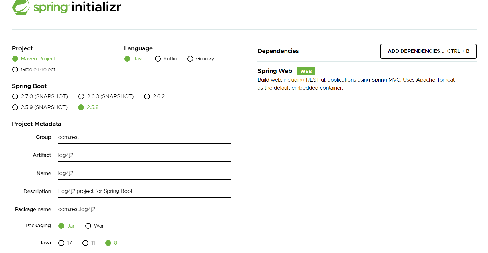
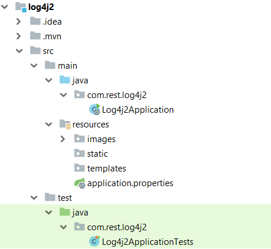
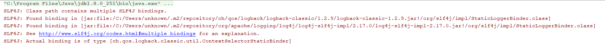
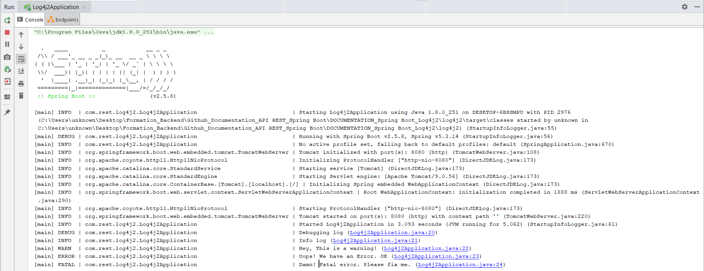
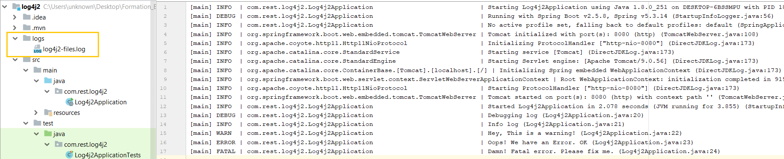

# Spring Boot - Log4j2
Dans ce tutoriel, nous allons apprendre comment intégrer et configurer Log4j2 dans une application Spring Boot

##### Log4J2
**Logging for Java** est une API de log proposée par la fondation Apache
##### Spring Boot
Spring Boot est un projet Spring qui facilite le processus de configuration et de publication des applications.

En suivant des étapes simples, vous pourrez exécuter votre premier projet.

##### Outils utilisés : 
* Java 8
* IDE Intellij IDEA
* Spring Boot 2.5.8 (avec Spring Web MVC)
* Maven 4.0.0


## Initialisation du projet
Pour amorcer une application Spring Boot , nous pouvons démarrer le projet à partir de zéro avec notre IDE préféré, ou simplement utiliser un autre moyen qui facilite la vie : [SpringInitializr](https://start.spring.io/)

Initialement, nous avons choisi la dépendances suivante : Spring web.



## Structure du projet
L'image ci-dessous montre la structure finale du projet



* **Pom.xml**

Contient des dépendances pour Spring Boot. Dans notre cas, nous sommes besoin de ces dépendances.

**spring-boot-starter-log4j2** : pour installer **Log4j2** dans le projet spring boot. 

=> Il faut exclure spring-boot-starter-logging, afin d'utiliser Log4j2 et éviter cette erreur :



```xml
<dependencies>
		<dependency>
			<groupId>org.springframework.boot</groupId>
			<artifactId>spring-boot-starter-web</artifactId>
		</dependency>
		<dependency>
			<groupId>org.springframework.boot</groupId>
			<artifactId>spring-boot-starter</artifactId>
			<exclusions>
				<exclusion>
					<groupId>org.springframework.boot</groupId>
					<artifactId>spring-boot-starter-logging</artifactId>
				</exclusion>
			</exclusions>
		</dependency>

		<dependency>
			<groupId>org.springframework.boot</groupId>
			<artifactId>spring-boot-starter-test</artifactId>
			<scope>test</scope>
		</dependency>
		<dependency>
			<groupId>org.springframework.boot</groupId>
			<artifactId>spring-boot-starter-log4j2</artifactId>
		</dependency>
	</dependencies>
```

* **Main Class**

C’est la classe principale de l’application et appelée aussi une classe de démarrage.

L ’adresse par défaut d’exécution : http://localhost:8080 

```java 
@SpringBootApplication
public class Log4j2Application {

	public static void main(String[] args) {
		SpringApplication.run(Log4j2Application.class, args);
	}

}
```

## I. Configuration de Log4j2
Spring Boot configure automatiquement Log4j s'il trouve un fichier nommé **log4j2.xml** ou **log4j2.json** ou **log4j2.yaml** ou **log4j2.properties** dans le chemin de classe.

Nous allons configurer log4j2 en utilisant XML tout en créant un nouveau fichier log4j2.xml dans src/main/resources:

La configuration ci-dessous définit un simple ConsoleAppender et déclare deux enregistreurs( un enregistreur spécifique à l'application et l'enregistreur racine).

- Log4J2 définit la notion d'appender pour identifier la destination de vos logs => Dans notre cas nous allons utiliser l'appender de type 
    - **< Console >** : permet d'ajouter les logs dans la console avec la possibilité de formater les logs sur la console.
    
Voici la signification des différentes séquences :

 - **%t** : permet d'injecter le nom du thread ayant produit le log.
 - **%-5p** : permet d'injecter le niveau (level) du log. Dans notre cas, il occupera cinq caractères et sera aligné par la gauche.
 - **%-60c** : permet d'injecter le nom du logger ayant généré ce log (dans notre cas, le nom pleinement qualifié de la classe).
 - **%m** : permet d'injecter le message du log.
 - **%F** : permet d'injecter le nom du fichier Java contenant la ligne de code ayant produit le log.
 - **%L** : permet d'injecter le numéro de ligne de code, dans le fichier considéré, ayant produit le log.
 - **%n** : permet d'injecter un retour à la ligne en fin de log.
 
 **< Loggers >** : pour contrôler les aspects des logs dans la section
  
 **< Logger name="com.rest.log4j2" level="debug" >**
  
   - **level**: sa valeur correspond aux niveaux de logs autorisés par défaut
     
  **< Root level="info" >** : pour contrôler les niveaux de log. Par défaut, seules les infos seront tracées.

```xml
<?xml version="1.0" encoding="UTF-8"?>
<Configuration status="WARN" monitorInterval="30">
    <Properties>
        <Property name="LOG_PATTERN">
            [%t] %-5p | %-60c | %m (%F:%L)%n
        </Property>
    </Properties>
    <Appenders>
        <Console name="ConsoleAppender" target="SYSTEM_OUT" follow="true">
            <PatternLayout pattern="${LOG_PATTERN}"/>
        </Console>
    </Appenders>
    <Loggers>
        <Logger name="com.example.log4j2demo" level="debug" additivity="false">
            <AppenderRef ref="ConsoleAppender" />
        </Logger>

        <Root level="info">
            <AppenderRef ref="ConsoleAppender" />
        </Root>
    </Loggers>
</Configuration>
```
## II. Utiliser Log4j2 dans l'application

Pour vérifier la configuration de notre enregistreur, nous allons ajouter le code de journalisation dans **Log4j2Application.java**

Nous allons ajouter 5 journaux simples de différents niveaux de journaux. 

```java
@SpringBootApplication
public class Log4j2Application implements ApplicationRunner {
	private static final Logger logger = LogManager.getLogger(Log4j2Application.class);

	public static void main(String[] args) {
		SpringApplication.run(Log4j2Application.class, args);
	}
	
	@Override
	public void run(ApplicationArguments args) throws Exception {
		logger.debug("Debugging log");
		logger.info("Info log");
		logger.warn("Hey, This is a warning!");
		logger.error("Oops! We have an Error. OK");
		logger.fatal("Damn! Fatal error. Please fix me.");
	}
}
```



## III. Ajout Rolling File Appender
- Pour écrire les logs dans un fichier, nous allons utiliser un appender RollingFile.
- L'appender de type **< RollingFile >** : permet d'ajouter les logs dans des fichiers tournant. Nous pouvons configurer les seuils permettant de passer au fichier suivant.
- Dans le code ci-dessous:
    - les logs seront envoyés dans le fichier **logs/log4j2-files.log** (attribut **fileName**).
    - **<TimeBasedTriggeringPolicy />** : indique qu'il faut changer de fichier à chaque nouveau jour.
    - **<SizeBasedTriggeringPolicy size="10 MB"/>** : indique que chaque fichier historisé ne pourra pas dépasser 10 MB.
    - Les fichiers historisés seront nommés d'après ce pattern : **logs/log4j2-file-%d{yyyy-MM-dd}-%i.log** 
        - **%d{yyyy-MM-dd}** : injecte la date courante dans le nom du fichier.
        - **%i** : injecte un index unique dans le nom d'un fichier.
- Pour utiliser l'appender RollingFile, nous allons ajouter la configuration de RollingFile à la section **< Appenders >**   
```xml
<RollingFile name="FileAppender" fileName="logs/log4j2-files.log"
                     filePattern="logs/log4j2-file-%d{yyyy-MM-dd}-%i.log">
            <PatternLayout>
                <Pattern>${LOG_PATTERN}</Pattern>
            </PatternLayout>
            <Policies>
                <TimeBasedTriggeringPolicy />
                <SizeBasedTriggeringPolicy size="10 MB"/>
            </Policies>
        </RollingFile>
```

- il est important d'enregistrer l'ppender dans la section **< Root >** sans quoi les logs ne seraient envoyés que sur la console. L'association est faite via l'attribut **ref="FileAppender"** qui doit correspondre à la valeur de l'attribut name de l'appender.

```xml
 <Root level="info">
            <AppenderRef ref="ConsoleAppender" />
            <AppenderRef ref="FileAppender"/>
        </Root>
```


## IV. Logging asynchrone
- Log4j2 prend en charge les logs asynchrones. Ces logs offrent une amélioration des performances par rapport aux logs synchrones.

- Les logs asynchrones utilisent en interne une bibliothèque appelée **Disruptor** pour la journalisation asynchrone.

```xml
<dependency>
    <groupId>com.lmax</groupId>
    <artifactId>disruptor</artifactId>
    <version>3.3.6</version>
</dependency>
```

Nous pouvons également utiliser un mélange de logs synchrones et asynchrones avec Log4j2 à l'aide de l'élément de configuration **< AsyncLogger >**.

```xml
    <AsyncLogger name="com.rest.log4j2" level="debug" additivity="false">
            <AppenderRef ref="ConsoleAppender"/>
            <AppenderRef ref="FileAppender"/>
        </AsyncLogger>
```
## V. Version finale de dépendances "Pom.xml"
```xml
<dependencies>
		<dependency>
			<groupId>org.springframework.boot</groupId>
			<artifactId>spring-boot-starter-web</artifactId>
		</dependency>
		<dependency>
			<groupId>org.springframework.boot</groupId>
			<artifactId>spring-boot-starter</artifactId>
			<exclusions>
				<exclusion>
					<groupId>org.springframework.boot</groupId>
					<artifactId>spring-boot-starter-logging</artifactId>
				</exclusion>
			</exclusions>
		</dependency>

		<dependency>
			<groupId>org.springframework.boot</groupId>
			<artifactId>spring-boot-starter-test</artifactId>
			<scope>test</scope>
		</dependency>
		<dependency>
			<groupId>org.springframework.boot</groupId>
			<artifactId>spring-boot-starter-log4j2</artifactId>
		</dependency>
		<dependency>
			<groupId>com.lmax</groupId>
			<artifactId>disruptor</artifactId>
			<version>3.3.6</version>
		</dependency>
	</dependencies>
```

## VI. Version finale "log4j2.xml"

```xml
<?xml version="1.0" encoding="UTF-8"?>
<Configuration status="WARN" monitorInterval="30">
    <Properties>
        <Property name="LOG_PATTERN">
            [%t] %-5p | %-60c | %m (%F:%L)%n
        </Property>
    </Properties>
    <Appenders>
        <Console name="ConsoleAppender" target="SYSTEM_OUT" follow="true">
            <PatternLayout pattern="${LOG_PATTERN}"/>
        </Console>
        <RollingFile name="FileAppender" fileName="logs/log4j2-files.log"
                     filePattern="logs/log4j2-file-%d{yyyy-MM-dd}-%i.log">
            <PatternLayout>
                <Pattern>${LOG_PATTERN}</Pattern>
            </PatternLayout>
            <Policies>
                <TimeBasedTriggeringPolicy/>
                <SizeBasedTriggeringPolicy size="10 MB"/>
            </Policies>
        </RollingFile>

    </Appenders>
    <Loggers>
        <AsyncLogger name="com.rest.log4j2" level="debug" additivity="false">
            <AppenderRef ref="ConsoleAppender"/>
            <AppenderRef ref="FileAppender"/>
        </AsyncLogger>

        <Root level="info">
            <AppenderRef ref="ConsoleAppender"/>
            <AppenderRef ref="FileAppender"/>
        </Root>
    </Loggers>
</Configuration>
```
